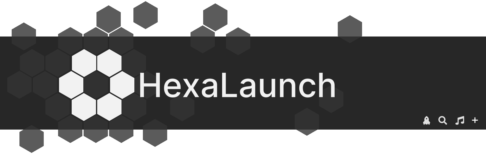
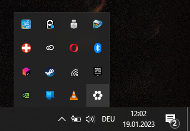
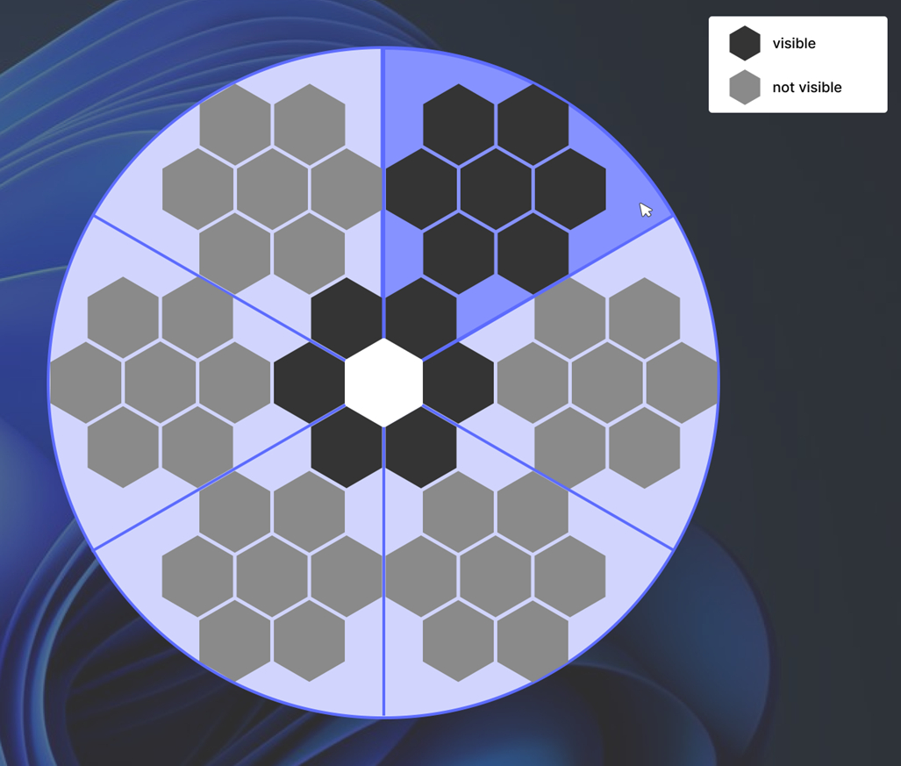

# HexaLaunch

A radial hexagon menu to boost productivity

# Getting started

After installing and starting the application for the first time the settings should open right away.  
If this is not the case, you can open the settings (and quit HexaLaunch) at any time by right-clicking the tray icon.



Jump to [Settings](#settings) to find out how to customize your application.  
<br>

# Using the HexUI

The default start hotkey to open the HexUI is `Ctrl`+`Shift`+`Space`.  
If there are no assets in your layout, an empty HexUI is displayed. If you have already filled your hexagons, you only need to click on them to launch the placed app.

The sub hexagons will pop up when you hover over their main hexagon. You don't necessarily have to hover over the main hexagons, they pop out when the mouse pointer is in their radius area (_image below_).

<!--   -->



## Keyboard Navigation

The keyboard navigation is not yet fully developed - currently you can fold out the sub hexagons with the number keys 1-6.

## Actions

| Icon                           | Name      | Description                                                                                                                                                                             |
| :----------------------------- | :-------- | :-------------------------------------------------------------------------------------------------------------------------------------------------------------------------------------- |
|       | Search    | The search detects almost all installed applications. When the HexUI is open, you can start typing to search for something. The search action does not have to be added to your layout. |
|  | Paper_bin | The paper bin action can empty your paper bin with one click. You can add the paper bin action to your layout in the settings.                                                          |
|         | Music     | Played music is detected and can be paused and skipped by hovering over the hexagon. You can add the music action to your layout in the settings.                                       |

<br>

# Settings

## Appearance

In the appearance tab you can select and create themes. You can always edit or delete your themes later using the icon buttons that become visible when you hover over them. If you don't know where to start, use existing themes as a starting point.  
You can also adjust the size and margin of the hexagons to your liking, as well as change the colors of the settings.

### Theme Menu Icons

-  use as a starting point
-  edit theme
-  delete theme

## Layout

In the layout tab you can drag & drop assets to add, switch and replace them. You can find apps using the search bar or browsing the relevant apps list, where you should find most important apps.

While hovering over filled hexagon a menu appears, with a bin and link icon. The bin icon lets you remove the asset, and the link icon lets you specify a URL that the application should open. After adding a browser, you can enter weblinks to open specific websites.

### Asset Menu Icons

-  remove asset
-  add URL

### Custom Apps

If you have personal custom apps or the search doesn’t find the app you’re looking for, you can drag & drop it into the relevant list. After that you can add it to your layout.

<!-- It doesn't necesarily have to be an .exe, any file or folder should work. -->

### Preferences

In the preferences you can set the start hotkey to open the HexUI and switch some settings (_Keyboard Navigation, Full Layout, Move to Cursor, Autostart_) on and off.

<br><br>

# Features

- [x] Launching Apps
- [x] Auto Start with Windows(/Mac)
- [x] Settings Menu
  - [x] Themes
  - [x] Hotkey
  - [x] Autostart
  - [x] App layout customization
- [x] Actions
  - [x] Searchbar
  - [x] Empty Paper bin
  - [x] Music/Media Control
- [x] Auto Updating
- [x] Add a possibility to add Apps to the Launcher without pasting the Apps install location. This can be one or multiple of these:
  - [x] Uninstall Registy
  - [x] Apps linked in the startMenu
  - [x] Detecting epic games
  - [x] Finding executables in the program files folders
  - [x] Finding linked files on the (public & useres) desktop
  - [x] Via Drap & Drop
  - [ ] Detecting steam games (via steam binary reading)
  - [ ] Via detecting active processes
  - [ ] Windows Store Apps

## Recommended IDE Setup

- [VSCode](https://code.visualstudio.com/) + [Tailwind CSS IntelliSense](https://marketplace.visualstudio.com/items?itemName=bradlc.vscode-tailwindcss) + [Prettier](https://marketplace.visualstudio.com/items?itemName=esbenp.prettier-vscode)

## Project Setup

### Install

The Tauri prerequisites need to be fulfilled: https://tauri.app/v1/guides/getting-started/prerequisites

```bash
$ npm install
```

### Development

Make sure you only have 1 instance of the app running at a time, as well as enough space for the dev dependencies (~ 18GB)

```bash
$ npm run tauri dev
```

### Build

Builds a executable for your current platform. Releases can be created via the github tauri_publish action by adding a new release tag.

```bash
$ npm run tauri build
```
